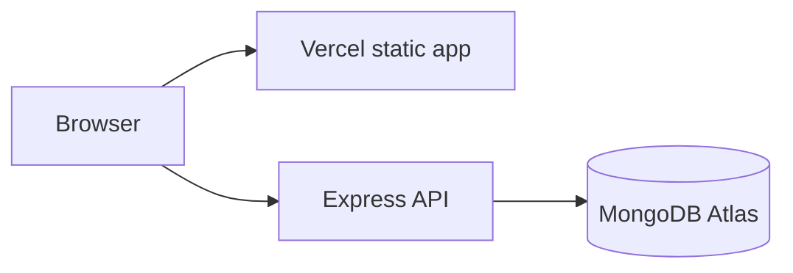

# Roshan Mishra — Portfolio

A full-width, animated portfolio built with the **MERN-style** stack: **React 19** + **Vite** + **TypeScript** + **Tailwind CSS** on the client, **Express** + **MongoDB** (Mongoose) for the API. Content is loaded from `GET /api/portfolio` (proxied to the API in dev).

---

## Project Structure

```
src/
├── server/                    # Express + MongoDB API
│   ├── seed/portfolio-seed.json   # Default portfolio document (edit + re-seed)
│   ├── src/
│   │   ├── index.js           # HTTP server, routes, auto-seed if DB empty
│   │   ├── seed.js            # Manual re-seed (clears slug `main`)
│   │   └── models/Portfolio.js
│   └── .env.example
└── frontend/
    ├── src/
    │   ├── components/        # UI + portfolio sections
    │   ├── hooks/PortfolioProvider.tsx   # TanStack Query → /api/portfolio
    │   ├── lib/api.ts
    │   └── types/portfolio.ts
    └── vite.config.js         # proxies /api → http://127.0.0.1:3001
```

---

## How to Run Locally

### Prerequisites

- **Node.js** v18+ and **npm** v9+ (see root `package.json` → `engines`)
- **MongoDB** running locally or a cloud URI (default: `mongodb://127.0.0.1:27017/portfolio`)

### 1. Install once (repo root)

```bash
cd /path/to/untitled   # your clone path
npm install
```

This installs all **workspace** packages (`src/frontend`, `src/server`).

### 2. Environment (optional)

If you skip this, the API uses `mongodb://127.0.0.1:27017/portfolio` and logs a reminder.

**Templates (safe to commit):** `.env.example` (repo root), `src/server/.env.example`, `src/frontend/.env.example`.

```bash
# Pick one (or both — root is loaded first, then src/server/.env)
cp .env.example .env
# and/or
cp src/server/.env.example src/server/.env
```

Edit `.env` and set **`MONGODB_URI`** (Atlas SRV with database name in the path, e.g. `.../portfolio?retryWrites=true&w=majority`). Never commit `.env` — it is gitignored.

For the **frontend** (optional local overrides):

```bash
cp src/frontend/.env.example src/frontend/.env
```

The server loads **repo root** `.env` first, then **`src/server/.env`** (later file overrides duplicate keys if both set).

### 3. Start the app

**Recommended — API + frontend together** (from **repo root**):

```bash
npm run dev
```

- Runs the API with **nodemon** (auto-restart on `src/server/src` changes) and the Vite dev server.
- **Frontend:** http://127.0.0.1:5000 (or http://localhost:5000)  
- **API:** http://127.0.0.1:3001  
- In dev, Vite **proxies** `/api/*` → the API on port **3001** (`src/frontend/vite.config.js`).

**From repo root** (same workspaces, two shortcuts):

| Command | What it runs |
|---------|----------------|
| `npm run start:server` | API only (`nodemon` in `src/server`) |
| `npm run start:frontend` | Vite only (`npm start` in `src/frontend`) |

**From package folders** (two terminals if you want them separate):

| Path | Command | Notes |
|------|---------|--------|
| `src/server` | `npm run dev` | **nodemon** — dev API on port **3001** |
| `src/server` | `npm start` | **node** — production-style API (no file watching) |
| `src/frontend` | `npm start` | Vite dev server on port **5000** (same as `npm run dev` there) |

If you only run the **frontend**, start the **API** as well or `/api/portfolio` will fail (nothing to proxy to).

### Database seeding

On first API start with an **empty** database, the server inserts `src/server/seed/portfolio-seed.json` for slug `main`.

To **reset** from the seed file (clears slug `main` and re-inserts):

```bash
cd src/server && npm run seed
```

### Production API URL (hosted separately)

If the built React app is not served behind the same origin as the API, set at **build** time:

`VITE_API_BASE_URL=https://your-api.example.com`

---

## Customizing the Portfolio

1. Edit **`src/server/seed/portfolio-seed.json`** (or update the document in MongoDB directly).
2. **Push changes into MongoDB** — the UI reads from the API/DB, not from the JSON file at runtime. If you already have a `main` document (e.g. old sample data), run:
   - **`npm run seed`** from the **repo root**, or
   - **`npm run seed`** from **`src/server`**  
   That replaces slug `main` with the current seed file. (A totally empty database is auto-seeded once on first API start only.)
3. Rebuild the frontend if you ship **`src/frontend/dist/`**: **`npm run build -w @roshan/portfolio-web`**

---

## Build

```bash
npm run build
```

Frontend output: `src/frontend/dist/`. Serve static files with any static host; point `VITE_API_BASE_URL` at your deployed API.

---

## Deployment roadmap (MongoDB + API + Vercel)

Production is **three pieces**: **MongoDB** (data), **Express API** (Node server), **Vite static site** (Vercel). The dev-time Vite proxy to `/api` does **not** exist on Vercel; the browser must call your API with an absolute URL via **`VITE_API_BASE_URL`**.



### Choose a frontend mode

| Mode | Vercel env vars | When to use |
|------|------------------|-------------|
| **Live API + MongoDB** | `VITE_API_BASE_URL=https://your-api.host` — and **do not** set `VITE_STATIC_PORTFOLIO` (or set it to `false`) | Content in DB; update via seed or MongoDB without rebuilding the site |
| **Static only (no Mongo)** | `VITE_STATIC_PORTFOLIO=true` | Cheapest/simplest; content is baked in from `portfolio-seed.json` at build time |

If `VITE_STATIC_PORTFOLIO` is `true`, the app **never** calls your API, even if `VITE_API_BASE_URL` is set.

---

### Phase 1 — MongoDB Atlas

1. Sign up at [MongoDB Atlas](https://www.mongodb.com/atlas) and create a **free M0** cluster.
2. **Database Access:** create a user (username + password). Store the password somewhere safe.
3. **Network Access:** add your IP for local testing; for Render/Railway/etc. add **`0.0.0.0/0`** (allow all) so cloud servers can connect, unless your host publishes fixed egress IPs you can whitelist.
4. **Connect** → Drivers → copy the **SRV** string. Replace `<password>` with your user’s password. Use a database name in the path, e.g. `...mongodb.net/portfolio?retryWrites=true&w=majority`.
5. This full string is your **`MONGODB_URI`** (keep it secret; never commit it).

---

### Phase 2 — Deploy the API (Node + Express)

Use any host that runs a **long-lived Node 18+** process (not Vercel serverless for this folder as-is). Examples: [Render](https://render.com), [Railway](https://railway.app), [Fly.io](https://fly.io).

**Typical settings (mirror these on any host):**

| Setting | Value |
|---------|--------|
| Repo | Same Git repo you pushed |
| **Root directory** | `src/server` |
| **Build command** | `npm install` |
| **Start command** | `npm start` |
| **Node version** | 18+ (match root `package.json` `engines` if the platform respects it) |

**Environment variables on the API host:**

| Variable | Required | Notes |
|----------|----------|--------|
| `MONGODB_URI` | Yes | Atlas SRV connection string |
| `PORT` | Usually automatic | Render/Railway often inject `PORT`; only set manually if the platform docs say so |

**CORS:** The API uses `cors({ origin: true })`, so requests from your Vercel domain are allowed.

After deploy, copy the public HTTPS origin of the API (example: `https://portfolio-api-xxxx.onrender.com`) with **no trailing slash**. You will use it as **`VITE_API_BASE_URL`**.

---

### Phase 3 — Seed production MongoDB

The UI reads **`GET /api/portfolio`**, which loads the document with slug **`main`**.

- If the database was **empty**, the API **auto-seeds** once on startup from `seed/portfolio-seed.json`.
- If you need to **reset** or replace data, run the seed script **against production**:

```bash
# From repo root (requires local Node + deps installed)
MONGODB_URI="your-atlas-uri-here" npm run seed -w @roshan/portfolio-api
```

Or from `src/server` with `MONGODB_URI` in `.env`:

```bash
cd src/server && npm run seed
```

**Verify the API:**

```text
GET https://YOUR-API-HOST/api/health   → {"ok":true}
GET https://YOUR-API-HOST/api/portfolio → your portfolio JSON
```

---

### Phase 4 — Deploy the frontend (Vercel)

1. [Vercel](https://vercel.com) → **Add New** → **Project** → import your Git repo.
2. Leave **Root Directory** as the **repository root** (where `vercel.json` lives).
3. Confirm Vercel picks up **`vercel.json`**: install `npm install`, build copies `src/frontend/dist` → repo root **`dist`** for upload, output directory **`dist`**, SPA rewrite to `index.html`. (This avoids dashboard settings that expect a root `dist` folder.)

**Environment variables** (set for **Production** and **Preview** if you use previews):

| Name | Value |
|------|--------|
| `VITE_API_BASE_URL` | `https://YOUR-API-HOST` (no trailing `/`) |

**Important:** Do **not** set `VITE_STATIC_PORTFOLIO=true` for this mode. If it is set in the Vercel UI from an old experiment, remove it or set it to `false`, then **redeploy** (Vite inlines env at build time).

After the first deploy or any change to these variables, trigger a **new deployment** (Redeploy).

---

### Phase 5 — End-to-end checklist

- [ ] Atlas cluster up; **`MONGODB_URI`** on the API host  
- [ ] **`GET …/api/health`** returns `{"ok":true}`  
- [ ] **`GET …/api/portfolio`** returns your JSON (run **seed** if 404)  
- [ ] Vercel: **`VITE_API_BASE_URL`** set; **`VITE_STATIC_PORTFOLIO`** not `true`  
- [ ] Open the Vercel URL; portfolio loads without console network errors to `/api/portfolio`  

---

### After go-live (content updates)

- Edit **`src/server/seed/portfolio-seed.json`**, then run **`npm run seed`** with production **`MONGODB_URI`** (local or CI). **No Vercel rebuild** unless you change frontend code.
- Or edit the `main` document directly in Atlas **Browse Collections**.

---

### Optional: Render “one-click” details

1. **New** → **Web Service** → connect repo.  
2. **Root Directory:** **`src/server`** *or* leave **empty** (repo root). Root uses `npm start` → `@roshan/portfolio-api`.  
3. **Build:** `npm install` — **Start:** `npm start`  
4. **Environment:** add **`MONGODB_URI`** (Atlas SRV). Without it, the API cannot reach MongoDB; **`/api/health`** should still return 200 after deploy.  
5. **502 Bad Gateway:** usually the Node process crashed (wrong root dir / no `start` script) or never bound to **`PORT`**. Check **Logs** for errors. Atlas must allow **`0.0.0.0/0`** (or Render egress).  
6. Open **Shell** on Render (or seed from your laptop) and run `npm run seed` with production `MONGODB_URI` if `/api/portfolio` is 404.

---

## Tech Stack

| Layer | Technology |
|-------|------------|
| UI | React 19, TypeScript, Vite 5, Tailwind CSS, Motion |
| Data | TanStack Query |
| API | Express, Mongoose, MongoDB |
